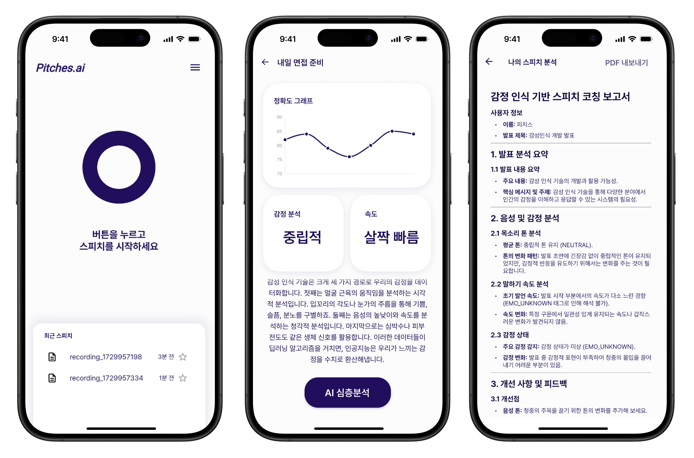
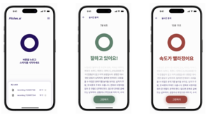

<div align="center">
<h1>Pitches.ai</h1>
<strong>감정인식 기반 AI 스피치 코칭 애플리케이션, 피치스</strong>
<p>
<p>
</div>

<p align="center">
<a href="#">
  
</a>
</p>

---

**2024 AI HACKATHON**

피치스(Pitches)는 sensevoice-small 모델을 활용해 감정분석을 수행하고, 결과를 토대로 사용자의 발표 및 스피치 수행을 돕는 애플리케이션입니다.

### 주요 기능

* **실시간 피드백**: 발표 분석 결과를 즉시 반영하여 색상으로 사용자에게 경고합니다.
    
    * 화면 가운데 링이 <font color="green">**녹색**</font>이면 **'좋음(Good)'**, <font color="red">**빨간색**</font>이면 **'나쁨(Bad)'** 상태를 나타냅니다.
    * 사용자는 피드백을 통해 즉각적으로 발표를 교정할 수 있습니다.
* **심층분석 보고서**: 녹음이 끝나면 분석 결과를 바탕으로 최종 결과 보고서를 출력합니다.
* **발표 스크립트**: Speech-to-Text API를 활용하여 녹음된 발표는 텍스트 스크립트로 내보낼 수 있습니다.

---

### 기술 스택

* **언어 및 프레임워크**: Dart, Flutter
* **주요 라이브러리**: flutter_riverpod, hive_flutter, flutter_markdown, speech_to_text

---

### 시작하기

프로젝트를 실행하려면 아래 단계를 따라주세요.

#### 필요 조건

시스템에 **Flutter SDK**가 설치되어 있어야 합니다.

#### 설치 및 실행

1. 의존성 주입
```bash
flutter pub get
```
2. 환경변수 설정 (.env 파일 생성)


3. 애플리케이션 실행
```bash
flutter run
```


---

Copyright (c) 2024 AIHACKATHON-TEAM20